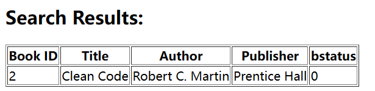
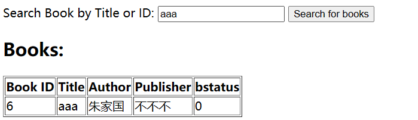

中国科学技术大学计算机学院

《数据库系统实验报告》

  

实验题目：图书管理系统

学生姓名：朱家国

学生学号：PB21111648

完成时间：2024年6月18日

## 1 需求分析
#### 1.1 数据需求

1. 图书信息：每本图书通过唯一的bookid标识，具有书名、作者、出版社、放置位置、图书状态、借阅次数以及预约次数信息。
2. 图书管理员：通过唯一的LibarianID标识，具有姓名、联系方式信息。
3. 学生：通过唯一的StudentID标识，具有姓名、联系方式、头像信息。
4. 学生预约书籍：包含学生ID、书籍ID、预约日期信息。
5. 学生借阅书籍：包含学生ID、书籍ID、借阅日期、应还日期、归还日期、逾期信息。
6. 学生借阅数据违约：包含学生ID、书籍ID、应还日期、逾期时间信息。

#### 1.2 功能需求

1. 图书信息管理：对书籍的增删查改。
2. 学生预约和借阅管理。
3. 违期管理：自动记录借阅违约、查询违约记录。
4. 系统登录和权限管理：用户登录（老师、学生）以及权限分配。

#### 1.3 视图需求

学生和管理员权限不同，登录界面也不同，需分别设计
1. 登录界面：输入正确的学生ID或者教师ID进行登录
2. 管理员界面
    - 个人信息
    - 查询、增加、修改、删除书籍信息
    - 查询所有学生预约、借阅、违约信息
3. 学生界面
    - 个人信息
    - 查询、预约、借阅、归还书籍
    - 查询自己的违约信息

## 2 总体设计

### 2.1 系统模块结构

  

- Web前端部分实现与用户的交互，包括登录、查询等。
- 服务端接受来自前端的数据请求，并完成与数据库的交互，其子模块功能如下：
  - 学生部分：查询、预约、借阅、归还书籍，查询违约信息。
  - 老师部分：
    - 查询模块：查询学生信息、预约信息、借阅信息、违约信息；
    - 图书管理模块：完成对图书的增删查改。
- 数据库对以上信息进行储存，并通过触发器、储存过程、函数、事务对部分数据进行自动化管理（如书籍状态的自动修改）。

### 2.2 系统工作流程

  

### 2.3 数据库设计
#### 2.3.1 ER图

  

#### 2.3.2 模式设计

1. Books (图书表)

    - BookID: INT，自增主键。
    - Title (书名): VARCHAR(255)，非空，书籍的标题。
    - Author (作者): VARCHAR(255)，非空，书籍的作者。
    - Publisher (出版社): VARCHAR(255)，非空，书籍的出版社。
    - Location (位置): VARCHAR(255)，非空，书籍在图书馆中的物理位置。
    - bstatus (状态): INT，默认值为 0，书籍的状态（0 = 可借阅，1 = 已借出，2 = 已预订）。有一个检查约束，确保值只能是 0, 1 或 2。
    - borrow_Times (借阅次数): INT，默认值为 0，书籍被借阅的次数。
    - reserve_Times (预订次数): INT，默认值为 0，书籍被预订的次数。
2. Librarians (图书管理员表)

    - LibrarianID: INT，主键。
    - Name (姓名): VARCHAR(255)，非空，图书管理员的姓名。
    - ContactInfo (联系信息): VARCHAR(255)，非空，图书管理员的联系信息。
3. Students (学生表)

    - StudentID: INT，主键。
    - Name (姓名): VARCHAR(255)，非空，学生的姓名。
    - ContactInfo (联系信息): VARCHAR(255)，非空，学生的联系信息。
    - AvatarPath (头像路径): VARCHAR(255)，学生头像图片的路径（可选）。
4. Reservations (预订表)

    - ReservationID: INT，自增主键。
    - StudentID: INT，非空，外键，引用 Students(StudentID)。
    - BookID: INT，非空，外键，引用 Books(BookID)。
    - ReservationDate (预订日期): DATE，非空，预订日期。
5. Borrowings (借阅表)

    - BorrowingID: INT，自增主键。
    - StudentID: INT，非空，外键，引用 Students(StudentID)。
    - BookID: INT，非空，外键，引用 Books(BookID)。
    - BorrowDate (借阅日期): DATE，非空，借阅书籍的日期。
    - DueDate (到期日期): DATE，非空，书籍的归还截止日期。
    - ReturnDate (归还日期): DATE，归还书籍的日期（可选）。
    - IsOverdue (是否逾期): BOOLEAN，默认值为 false，指示借阅是否逾期。
6. OverdueBorrowings (逾期借阅表)

    - OverdueID: INT，自增主键。
    - StudentID: INT，非空，外键，引用 Students(StudentID)。
    - BookID: INT，非空，外键，引用 Books(BookID)。
    - DueDate (到期日期): DATE，非空，书籍的到期日期。
    - OverdueDays (逾期天数): INT，默认值为 1，逾期的天数。

#### 2.3.3 触发器设计
##### 自动更新应还日期
插入借阅信息时，自动计算应还日期

    CREATE TRIGGER calculate_due_date
    BEFORE INSERT ON Borrowings
    FOR EACH ROW
    BEGIN
        -- 计算应还日期为借阅日期后14天
        SET NEW.DueDate = DATE_ADD(NEW.BorrowDate, INTERVAL 14 DAY);
    END

##### 计算学生头像路径
插入学生信息时，根据学生ID计算对应头像在文件夹中储存位置

    CREATE TRIGGER SetDefaultAvatarPath
    BEFORE INSERT ON Students
    FOR EACH ROW
    BEGIN
        SET NEW.AvatarPath = CONCAT('figs/', NEW.StudentID, '.jpg');
    END

##### 学生预约
学生预约后，若书籍未借出，则bstatus设置为2，若已经借出，则bstatus保持1不变。数据预约次数加一。

    CREATE TRIGGER after_insert_reservation
    AFTER INSERT ON Reservations
    FOR EACH ROW
    BEGIN
        UPDATE Books
        SET 
            bstatus = CASE 
                        WHEN bstatus = 1 THEN bstatus 
                        ELSE 2 
                    END, 
            reserve_Times = reserve_Times + 1
        WHERE BookID = NEW.BookID;
    END

##### 取消预约
学生取消预约之后，数据预约次数减一。

    CREATE TRIGGER after_delete_reservation
    AFTER DELETE ON Reservations
    FOR EACH ROW
    BEGIN
        UPDATE Books
        SET reserve_Times = reserve_Times - 1
        WHERE BookID = OLD.BookID;
    END

##### 学生借阅
借阅表插入后，减少书籍预约次数。

    CREATE TRIGGER after_insert_borrowing
    AFTER INSERT ON Borrowings
    FOR EACH ROW
    BEGIN
        UPDATE Books
        SET 
            reserve_Times = CASE 
                            WHEN EXISTS (SELECT 1 FROM Reservations WHERE BookID = NEW.BookID) 
                            THEN reserve_Times - 1 
                            ELSE reserve_Times 
                            END,
            bstatus = 1
        WHERE BookID = NEW.BookID;
    END

##### 修改bstatus
当某本书的最后一位预约者取消预约且该书未被借出时，将bstatus改为0

    CREATE TRIGGER book_last_reservation_canceled
    AFTER DELETE ON reservations
    FOR EACH ROW
    BEGIN
        DECLARE remaining_reservations INT;
        DECLARE book_status INT;
        
        -- 计算剩余预约数
        SELECT COUNT(*) INTO remaining_reservations
        FROM Reservations
        WHERE bookID = OLD.bookID;
        
        -- 获取图书状态
        SELECT bstatus INTO book_status
        FROM Books
        WHERE bookid = OLD.bookID;
        
        -- 如果剩余预约数为0且图书状态为2，则将图书状态改为0
        IF remaining_reservations = 0 AND book_status = 2 THEN
            UPDATE Books
            SET bstatus = 0
            WHERE bookid = OLD.bookID;
        END IF;
    END

##### 还书时修改bstatus
还书在数据库中的操作对应为在借阅表对应条目中加入还书日期信息。

更新借阅表后，若没有预约，则bstatus设置为0，否则设置为2。

    CREATE TRIGGER after_update_returnDate
    AFTER UPDATE ON Borrowings
    FOR EACH ROW
    BEGIN
        -- 检查 ReturnDate 是否被更新
        IF NEW.ReturnDate IS NOT NULL AND OLD.ReturnDate IS NULL THEN
            -- 检查书籍是否有预约
            IF (SELECT COUNT(*) FROM Reservations WHERE BookID = NEW.BookID) = 0 THEN
                -- 没有预约，设置 bstatus 为 0
                UPDATE Books
                SET bstatus = 0
                WHERE BookID = NEW.BookID;
            ELSE
                -- 有预约，设置 bstatus 为 2
                UPDATE Books
                SET bstatus = 2
                WHERE BookID = NEW.BookID;
            END IF;
        END IF;
    END

#### 2.3.4 函数设计
##### 获取书籍总数

    CREATE FUNCTION GetBookCount()
    RETURNS INT
    READS SQL DATA
    BEGIN
        DECLARE book_count INT;
        
        SELECT COUNT(*) INTO book_count FROM Books;
        
        RETURN book_count;
    END 

#### 2.3.5 储存过程设计
##### 检查并更新违约信息
遍历借阅表，若存在未归还书籍且当前日期超过应还日期，则将其加入违约表中。

对应违约表中的记录，若对应书籍已经被归还，则删除违约信息。

    CREATE PROCEDURE CheckAndUpdateOverdueBorrowings()
    BEGIN
        -- Declare variables
        DECLARE done INT DEFAULT 0;
        DECLARE v_BorrowingID INT;
        DECLARE v_StudentID INT;
        DECLARE v_BookID INT;
        DECLARE v_DueDate DATE;
        DECLARE v_OverdueDays INT;
        
        -- Declare a cursor to iterate through overdue borrowings
        DECLARE cur CURSOR FOR
            SELECT BorrowingID, StudentID, BookID, DueDate
            FROM Borrowings
            WHERE DueDate < CURDATE() AND IsOverdue = FALSE;
        
        -- Declare a handler to close the cursor
        DECLARE CONTINUE HANDLER FOR NOT FOUND SET done = 1;
        
        -- Open the cursor
        OPEN cur;
        
        -- Loop through the results
        read_loop: LOOP
            FETCH cur INTO v_BorrowingID, v_StudentID, v_BookID, v_DueDate;
            
            IF done THEN
                LEAVE read_loop;
            END IF;
            
            -- Calculate overdue days
            SET v_OverdueDays = DATEDIFF(CURDATE(), v_DueDate);
            
            -- Update the Borrowings table
            UPDATE Borrowings
            SET IsOverdue = TRUE
            WHERE BorrowingID = v_BorrowingID;
            
            -- Insert the overdue record into OverdueBorrowings table
            INSERT INTO OverdueBorrowings (StudentID, BookID, DueDate, OverdueDays)
            VALUES (v_StudentID, v_BookID, v_DueDate, v_OverdueDays);
        END LOOP;
        
        -- Close the cursor
        CLOSE cur;
        
        -- Remove returned books from OverdueBorrowings
        DELETE FROM OverdueBorrowings
        WHERE BookID IN (
            SELECT BookID
            FROM Borrowings
            WHERE ReturnDate IS NOT NULL
        );
    END

## 3 核心代码解析

### 3.1 仓库地址

> https://github.com/SumuduZ/2024-Lab2.git

### 3.2 目录
  
    │  app.js                       ------服务器端文件
    │  package-lock.json
    │  package.json
    │  report.html
    │  report.md
    │
    ├─figs                          ------实验报告图像
    │      ER.png
    │      logo.png
    │      produce.png
    │      struct.png
    │
    ├─node_modules                  ------包含的npm包
    │
    ├─sql                           ------数据库文件
    │      createtable.sql
    │      daletetable.sql
    │      deletedata.sql
    │      insertdata.sql
    │      procedures.sql
    │      triggers.sql
    │
    └─views                         ------前端文件视图
        │  librarian.ejs
        │  login.ejs
        │  student.ejs
        │
        └─figs                      ------学生头像储存位置
                1001.jpg

### 3.3 登录设计
#### 3.3.1 前端设计
登录界面设计如下：（1）选择教师或者学生登录；（2）输入学生ID或者老师ID；（3）输入姓名。提交后触发函数`handleLogin(event)`。

    //views/login.ejs
    <form onsubmit="handleLogin(event)">
        <label for="userType">User Type:</label>
        <select id="userType" name="userType" required>
            <option value="student">Student</option>
            <option value="librarian">Librarian</option>
        </select>
        
        <label for="id">ID:</label>
        <input type="text" id="id" name="id" required>
        
        <label for="name">Name:</label>
        <input type="text" id="name" name="name" required>
        
        <button type="submit">Login</button>
    </form>

处理登录信息：（1）阻止表单的自动提交；（2）将表单数据以json包形式发送到后端；（3）接收后端返回json包，根据对应登录信息重定向页面

    //views/logins.ejs
    function handleLogin(event) {
            event.preventDefault();

            const userType = document.getElementById('userType').value;
            const id = document.getElementById('id').value;
            const name = document.getElementById('name').value;

            fetch('/login', {
                method: 'POST',
                headers: {
                    'Content-Type': 'application/json'
                },
                body: JSON.stringify({ userType, id, name })
            })
            .then(response => response.json())
            .then(data => {
                if (data.success) {
                    if (data.userType === 'student') {
                        window.location.href = '/student/' + data.id;
                    } else if (data.userType === 'librarian') {
                        window.location.href = '/librarian/' + data.id;
                    }
                } else {
                    alert(data.error);
                }
            })
            .catch(error => {
                console.error('Error:', error);
                alert('An error occurred. Please try again later.');
            });
        }
#### 3.3.2 后端设计
收到前端传回的json数据包后，检查是否存在对应的学生或老师。若存在，返回对应的学生或者老师信息；否则返回错误登录信息。

    // app.js
    // 处理登录请求
    app.post('/login', (req, res) => {
        const { userType, id, name } = req.body;

        if (userType === 'student') {
            db.query('SELECT * FROM Students WHERE StudentID = ? AND Name = ?', [id, name], (err, results) => {
                if (err) {
                    res.status(500).json({ error: 'Database query error' });
                } else if (results.length > 0) {
                    res.status(200).json({ success: true, userType: 'student', id: id });
                } else {
                    res.status(401).json({ error: 'Invalid student credentials' });
                }
            });
        } else if (userType === 'librarian') {
            db.query('SELECT * FROM Librarians WHERE LibrarianID = ? AND Name = ?', [id, name], (err, results) => {
                if (err) {
                    res.status(500).json({ error: 'Database query error' });
                } else if (results.length > 0) {
                    res.status(200).json({ success: true, userType: 'librarian', id: id });
                } else {
                    res.status(401).json({ error: 'Invalid librarian credentials' });
                }
            });
        } else {
            res.status(400).json({ error: 'Invalid user type' });
        }
    });

### 3.4 学生页面设计
学生端功能包括：查询书籍、预约书籍、取消预约、查询预约、借出书籍、归还书籍、查询借阅信息、查询违约信息。由于各部分实现大抵相同，以下仅以预约书籍、查询预约和查询违约为例说明代码设计。
#### 3.4.1 个人信息
##### 前端设计
输出学生姓名、学生ID，根据学生头像信息在对应文件夹中读取对应的图像。

    // views/student.ejs
    <h1>Welcome, <%= student.Name %></h1>
    

        " alt="Avatar" style="width: 150px; height: 150px; border-radius: 50%;">
    

    
ID: <%= student.StudentID %>

    
Contact Info: <%= student.ContactInfo %>

##### 后端设计
在数据库中读取对应学生信息，使用学生信息渲染student页面

    // app.js
    // 学生页面
    app.get('/student/:id', (req, res) => {
        const studentID = req.params.id;
        db.query('SELECT * FROM Students WHERE StudentID = ?', [studentID], (err, results) => {
            if (err) {
                res.status(500).send('Database query error');
            } else if (results.length > 0) {
                res.render('student', { student: results[0] });
            } else {
                res.status(404).send('Student not found');
            }
        });
    });

#### 3.4.2 预约书籍
##### 前端设计
输入书籍ID或者书籍名称预约书籍，点击提交后触发函数`handleReserveBook(event)`。该函数通过post方法将数据传到后端，接收后端返回的信息并以此提示预约成功或者失败。

    // views/student.ejs
    <h2>Reserve Books</h2>
    <!-- 预约书籍表单 -->
    <form onsubmit="handleReserveBook(event)">
        <input type="hidden" name="studentID" value="<%= student.StudentID %>">
        <label for="bookID">Book ID:</label>
        <input type="text" id="bookID" name="bookID">
        <label for="bookTitle">Book Title:</label>
        <input type="text" id="bookTitle" name="bookTitle">
        <label for="reservationDate">Reservation Date:</label>
        <input type="date" id="reservationDate" name="reservationDate">
        <button type="submit">Reserve</button>
    </form>

    // 处理预约表单提交
    function handleReserveBook(event) {
        event.preventDefault();
        const form = event.target;
        const studentID = form.studentID.value;
        const bookID = form.bookID.value;
        const bookTitle = form.bookTitle.value;
        const reservationDate = form.reservationDate.value;
            
        if (!bookID && !bookTitle) {
            alert('Please provide either a book ID or book title.');
            return;
        }

        if (!reservationDate) {
            alert('Please provide a reservation date.');
            return;
        }

        fetch('/student/reserveBook', {
            method: 'POST',
            headers: {
                'Content-Type': 'application/json'
            },
            body: JSON.stringify({ studentID, bookID, bookTitle, reservationDate })
        })
        .then(response => response.json())
        .then(data => {
            if (data.error) {
                alert(data.error);
            } else {
                alert(data.message);
            }
        })
        .catch(error => {
            console.error('Error:', error);
            alert('An error occurred. Please try again later.');
        });
    }

##### 后端设计
根据前端输入的书籍ID或者书籍名称查询数据库，若没有对应书籍，则返回错误信息；若查询到对应书籍则返回书籍信息。（此处查询学生预约信息为冗余设计，本意用于拓展功能但最终未实现）

    // app.js
    // 预约书籍
    app.post('/student/reserveBook', (req, res) => {
        const { studentID, bookID, bookTitle, reservationDate } = req.body;

        // 如果提供了书籍ID，则根据书籍ID查询；否则根据书籍名查询
        let query = 'SELECT * FROM Books WHERE ';
        let queryParams = [];
        if (bookID) {
            query += 'BookID = ?';
            queryParams.push(bookID);
        } else if (bookTitle) {
            query += 'Title = ?';
            queryParams.push(bookTitle);
        } else {
            return res.status(400).json({ error: 'Please provide either a book ID or book title.' });
        }

        db.query(query, queryParams, (err, bookResults) => {
            if (err) {
                return res.status(500).json({ error: 'Database1 query error' });
            } else if (bookResults.length === 0) {
                return res.status(404).json({ error: 'Book not found' });
            }

            const bookIDToReserve = bookResults[0].BooKID;

            // 插入预约记录到数据库
            const insertQuery = 'INSERT INTO reservations (StudentID, BookID, ReservationDate) VALUES (?, ?, ?)';
            db.query(insertQuery, [studentID, bookIDToReserve, reservationDate], (err, result) => {
                if (err) {
                    console.error('数据库查询错误2:', err);  // 记录实际错误
                    return res.status(500).json({ error: '数据库查询错误2', details: err.message });
                }

                // 查询学生的所有预约信息
                db.query('SELECT * FROM Reservations WHERE StudentID = ?', [studentID], (err, reservations) => {
                    if (err) {
                        return res.status(500).json({ error: 'Database3 query error' });
                    }
                    res.status(200).json({ message: 'Book reserved successfully', reservations });
                });
            });
        });
    });

#### 3.4.3 查询预约
##### 前端设计
点击查询按钮后触发函数`searchReservations(event)`。该函数将学生ID传到后端，根据后端数据调用函数`updateReservationsTable(reservations)`修改预约信息表格。

    // views/student.ejs
    <!-- 查询所有预约信息 -->
    <form onsubmit="searchReservations(event)">
        <input type="hidden" name="studentID" value="<%= student.StudentID %>">
        <button type="submit">Search Reservation</button>
    </form>

    <!-- 预约信息表格 -->
    <h2>Your Reservations:</h2>
    <table border="1">
        <thead>
            <tr>
                <th>Reservation ID</th>
                <th>Book ID</th>
                <th>Reservation Date</th>
            </tr>
        </thead>
        <tbody id="reservationsTableBody">
            <% if (typeof reservations !== 'undefined') { %>
                <% reservations.forEach(reservation => { %>
                    <tr>
                        <td><%= reservation.ReservationID %></td>
                        <td><%= reservation.BookID %></td>
                        <td><%= reservation.ReservationDate %></td>
                    </tr>
                <% }) %>
            <% } %>
        </tbody>
    </table>
    
    function searchReservations(event) {
        event.preventDefault();
        const form = event.target;
        const studentID = form.studentID.value;

        fetch('/student/searchReservations', {
            method: 'POST',
            headers: {
                'Content-Type': 'application/json'
            },
            body: JSON.stringify({ studentID })
        })
        .then(response => response.json())
        .then(data => {
            if (data.error) {
                alert(data.error);
            } else {
                alert(data.message);
                if (data.reservations) {
                    updateReservationsTable(data.reservations);
                }
            }
        })
        .catch(error => {
            console.error('Error:', error);
            alert('An error occurred. Please try again later.');
        });
    }

    // 更新预约信息表格
    function updateReservationsTable(reservations) {
        const tableBody = document.getElementById('reservationsTableBody');
        tableBody.innerHTML = '';
        reservations.forEach(reservation => {
            const row = document.createElement('tr');
            row.innerHTML = `
                <td>${reservation.ReservationID}</td>
                <td>${reservation.BookID}</td>
                <td>${reservation.ReservationDate}</td>
            `;
            tableBody.appendChild(row);
        });
    }

##### 后端设计
    根据前端传回的学生ID在预约表中查询学生预约信息。

    // app.js
    // 查询预约信息
    app.post('/student/searchReservations', (req, res) => {
        const { studentID } = req.body;
        const query = 'SELECT * FROM Reservations WHERE StudentID = ?';
        db.query(query, [studentID], (err, reservations) => {
            if (err) {
                return res.status(500).json({ error: 'Database query error' });
            } else {
                res.status(200).json({ message: 'check successfully' , reservations});  // 确保返回的数据格式正确
            }
        });
    });
    
> 分为若干个标题，以一定逻辑顺序讲解代码，如按ER图实体、关系讲解数据库建模代码，按存储过程、触发器分类讲解代码、按前端实现、接口等讲解前端代码
>
> 注意不要无脑粘贴代码，选取具有代表性的代码讲解，并注明文件来源，如首行注释: // backend\models.py

#### 3.4.4 查询违约
##### 前端设计
点击查询后触发函数`checkOverdue(event)`，该函数接收后端信息后调用函数`updateOverdueTable(overdues)`修改违约信息表格。

    // views/student.ejs
    <!-- 违约查询按键 -->
    <form onsubmit="checkOverdue(event)">
        <input type="hidden" name="studentID" value="<%= student.StudentID %>">
        <button type="submit">违约查询</button>
    </form>

    <!-- 违约信息表格 -->
    <h2>Your Overdue:</h2>
    <table border="1">
        <thead>
            <tr>
                <th>Overdue ID</th>
                <th>Book ID</th>
                <th>Overdue Date</th>
            </tr>
        </thead>
        <tbody id="overdueTableBody">
            <% if (typeof overdues !== 'undefined') { %>
                <% overdues.forEach(overdue => { %>
                    <tr>
                        <td><%= overdue.OverdueID %></td>
                        <td><%= overdue.BookID %></td>
                        <td><%= overdue.OverdueDays %></td>
                    </tr>
                <% }) %>
            <% } %>
        </tbody>
    </table>
    
    //处理违约查询表单提交
    function checkOverdue(event){
        event.preventDefault();
        const form = event.target;
        const studentID = form.studentID.value;

        fetch('/student/checkOverdue', {
            method: 'POST',
            headers: {
                'Content-Type': 'application/json'
            },
            body: JSON.stringify({ studentID })
        })
        .then(response => response.json())
        .then(data => {
            if (data.error) {
                alert(data.error);
            } else {
                alert(data.message);
                if (data.overdues) {
                    updateOverdueTable(data.overdues);
                }
            }
        })
        .catch(error => {
            console.error('Error:', error);
            alert('An error occurred. Please try again later.');
        });
    }

        // 更新违约信息表格
        function updateOverdueTable(overdues) {
            const tableBody = document.getElementById('overdueTableBody');
            tableBody.innerHTML = '';
            overdues.forEach(overdue => {
                const row = document.createElement('tr');
                row.innerHTML = `
                    <td>${overdue.OverdueID}</td>
                    <td>${overdue.BookID}</td>
                    <td>${overdue.OverdueDays}</td>
                `;
                tableBody.appendChild(row);
            });
        }
        
##### 后端设计
查询前首先调用存储过程`CheckAndUpdateOverdueBorrowings()`对违约表进行更新。在根据学生学号查询违约表中学生对应信息。

    // app.js
    // 查询逾期信息
    app.post('/student/checkOverdue', (req, res) => {
        const { studentID } = req.body;

        // 调用存储过程以更新逾期信息
        const updateOverdueProcedure = 'CALL CheckAndUpdateOverdueBorrowings()';

        db.query(updateOverdueProcedure, (err, result) => {
            if (err) {
                return res.status(500).json({ error: 'Error updating overdue borrowings' });
            } else {
                // 在调用存储过程后查询逾期信息
                const query = 'SELECT * FROM OverdueBorrowings WHERE StudentID = ?';
                db.query(query, [studentID], (err, overdues) => {
                    if (err) {
                        return res.status(500).json({ error: 'Database query error' });
                    } else {
                        res.status(200).json({ message: 'Check successfully', overdues });  // 确保返回的数据格式正确
                    }
                });
            }
        });
    });
### 3.5 管理员（老师）页面设计
管理员端功能包括：查询书籍总数、对书籍增删查改、查询学生、查询预约、查询借阅、查询违约。以下以查询书籍总数、修改书籍信息为例说明代码设计。
#### 3.5.1 查询书籍总数
##### 前端设计
点击查询后触发函数`searchBookCount(event)`，该函数从后端获取结果后修改`id="bookCountResult"`对应字段。

    // views/librarian.ejs
    <!-- 查询书籍总数 -->
    <h2>Books Count</h2>
    <form onsubmit="searchBookCount(event)">
        <input type="hidden" name="librarianID" value="<%= librarian.LibrarianID %>">
        <button type="submit">Check Books Count</button>
    </form>

    <!-- 查询结果 -->
    

    function searchBookCount(event) {
        event.preventDefault();
        const form = event.target;
        const librarianID = form.librarianID.value;

        fetch('/librarian/searchBookCount', {
            method: 'POST',
            headers: {
                'Content-Type': 'application/json'
            },
            body: JSON.stringify({ librarianID })
        })
        .then(response => response.json())
        .then(data => {
            if (data.error) {
                alert(data.error);
            } else {
                //alert(data.message);
                document.getElementById('bookCountResult').innerText = `Total Books: ${data.bookCount}`;
            }
        })
        .catch(error => {
            console.error('Error:', error);
            alert('An error occurred. Please try again later.');
        });
    }

##### 后端设计
调用数据库中函数`GetBookCount()`获取书籍总数。

    // 查询图书总数
    app.post('/librarian/searchBookCount', (req, res) => {
        const query = 'SELECT GetBookCount() AS bookCount';

        db.query(query, (err, results) => {
            if (err) {
                console.error('Database query error:', err);
                return res.status(500).json({ error: 'Database query error' });
            }

            const bookCount = results[0].bookCount; // Assuming stored procedure returns book_count

            res.status(200).json({ bookCount });
        });
    });

#### 3.5.2 修改书籍信息
##### 前端设计
输入图书ID作为书籍定向信息，接着输入修改后的书籍作者、出版社、位置（若为空则说明不修改该项）。点击提交后触发函数`updateBook(event)`，该函数将表格数据传回后端并显示成功或者失败信息。

    // views/librarian.ejs
    <!-- 修改图书信息 -->
    <h2>update book info</h2>
    <form onsubmit="updateBook(event)">
        <label for="updateBookID">Book ID:</label>
        <input type="text" id="updateBookID" name="updateBookID">
        <label for="updateAuthor">Author:</label>
        <input type="text" id="updateAuthor" name="updateAuthor">
        <label for="updatePublisher">Publisher:</label>
        <input type="text" id="updatePublisher" name="updatePublisher">
        <label for="updateLocation">Location:</label>
        <input type="text" id="updateLocation" name="updateLocation">
        <button type="submit">Update Book</button>
    </form>

    function updateBook(event) {
        event.preventDefault();
        const form = event.target;
        const bookID = form.updateBookID.value;
        const author = form.updateAuthor.value;
        const publisher = form.updatePublisher.value;
        const location = form.updateLocation.value;

        if (!author && !publisher && !location) {
            alert('Please provide at least one field to update.');
            return;
        }

        fetch('/librarian/updateBook', {
            method: 'POST',
            headers: {
                'Content-Type': 'application/json'
            },
            body: JSON.stringify({ bookID, author, publisher, location })
        })
        .then(response => response.json())
        .then(data => {
            if (data.error) {
                alert(data.error);
            } else {
                alert(data.message);
            }
        })
        .catch(error => {
            console.error('Error:', error);
            alert('An error occurred. Please try again later.');
        });
    }

##### 后端设计
事务编程，根据前端信息修改书籍表中数据。

    // app.js
    app.post('/librarian/updatebook', (req, res) => {
        db.Transaction((err, t) => {
            if (err) {
                return res.status(500).json({ error: 'Database transaction error' });
            }

            const { bookID, author, publisher, location } = req.body;

            // 检查至少一个字段不为空
            if (!author && !publisher && !location) {
                return res.status(400).json({ error: 'Please provide at least one field to update.' });
            }

            // 构建动态查询
            let query = 'UPDATE Books SET ';
            let params = [];
            if (author) {
                query += 'Author = ?, ';
                params.push(author);
            }
            if (publisher) {
                query += 'Publisher = ?, ';
                params.push(publisher);
            }
            if (location) {
                query += 'Location = ?, ';
                params.push(location);
            }

            // 移除最后一个逗号和空格
            query = query.slice(0, -2);
            query += ' WHERE BookID = ?';
            params.push(bookID);

            db.query(query, params, (err, result) => {
                if (err) {
                    t.rollback();
                    return res.status(500).json({ error: 'Database query error' });
                } else {
                    t.commit();
                    res.status(200).json({ message: 'Book updated successfully' });
                }
            });
        });
    });

## 4 实验与测试

### 4.1依赖

实验运行所需npm包为：`express`包，`mysql2`包，`body-parser`包，`ejs`包。通过以下命令安装（xxx为对应的npm包）。

    npm install xxx

### 4.2 部署

在文件夹下运行终端，输入

    node app.js

打开浏览器访问`http://localhost:3000`即可。

### 4.3 实验结果
在数据库中插入如下初始数据：

    -- 插入图书信息
    INSERT INTO Books (Title, Author, Publisher, Location) 
    VALUES
    ('Introduction to Algorithms', 'Thomas H. Cormen', 'MIT Press', 'A1'),
    ('Clean Code', 'Robert C. Martin', 'Prentice Hall', 'B2'),
    ('The Pragmatic Programmer', 'Andrew Hunt', 'Addison-Wesley', 'C3'),
    ('Design Patterns', 'Erich Gamma', 'Addison-Wesley', 'D4'),
    ('Artificial Intelligence: A Modern Approach', 'Stuart Russell', 'Pearson', 'E5');

    -- 插入图书管理员
    INSERT INTO Librarians (LibrarianID, Name, ContactInfo)
    VALUES
    (1, 'Alice Smith', 'alice@example.com'),
    (2, 'Bob Johnson', 'bob@example.com');

    -- 插入学生
    INSERT INTO Students (StudentID, Name, ContactInfo)
    VALUES
    (1001, 'John Doe', 'john.doe@example.com'),
    (1002, 'Jane Roe', 'jane.roe@example.com');

    -- 插入预约信息
    INSERT INTO Reservations (StudentID, BookID, ReservationDate)
    VALUES
    (1001, 1, '2024-06-18'),
    (1002, 3, '2024-06-18'),
    (1001, 2, '2024-06-19');

    -- 插入借阅信息
    INSERT INTO Borrowings (StudentID, BookID, BorrowDate, ReturnDate)
    VALUES
    (1001, 1, '2024-05-30', '2024-06-14'),
    (1001, 4, '2024-06-02', NULL);

以学生1001身份登录。

查询书籍2信息（验证书籍bstatus为2）

查询预约信息

查询违约信息

查询借阅信息

借出书籍2
查询书籍2信息

归还书籍2
查询书籍2信息

以管理员1身份登录。

查询书籍总数

查询学生1001

查询书籍2

增加书籍

查询对应书籍

修改该书籍信息

查询修改书籍

删除该书籍

查询该书籍信息

